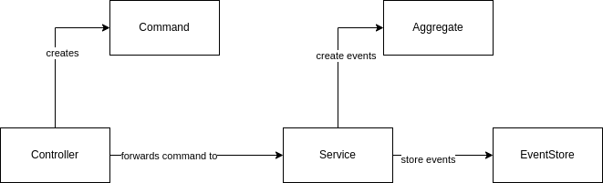

# Event Sourcing

**Event Sourcing is a persistence pattern, defining how your application will store your data. Don't confuse it with event driven architectures
where one uses events for communication.**

This diagram shows how the underlying source code is structured.

This is only the write part of a very basic event sourcing structure. A fully featured system would require one to fully implement [CQRS](https://martinfowler.com/bliki/CQRS.html).

The basic idea is, to have a command which enters the system, gets forwarded to a service, which then takes care of creating events and persisting
those using the event store.

In order to create events based on a command, one first of all loads all events for the given document. Those events are used to build an aggregate. The aggreate knows how to work with the event stream (simply a list of events in this case). This is used for validation or calculation of certain values. As soon as the aggregate is initizlized, it offers a `handleCommand`  method, which takes the initial command and the underlying event stream to generate
1 - n new events. Those will be returned to the service, and the service just forwards them to the event store.

The event store will simply write them into a database / datasource.
